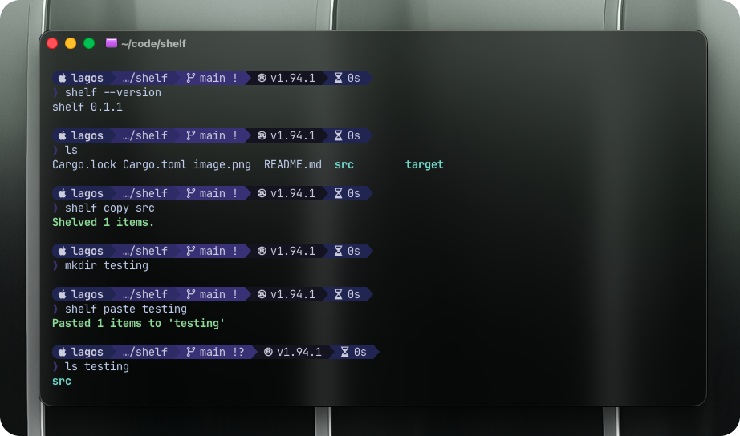

<div align="center">

# Shelf 🍱

**"A "git stash" like command, for files and folders.**



</div>

## The Problem

Standard terminal clipboards (`pbcopy`, `xclip`) are great for text, but they choke on files and folders.

Sometimes you just need to grab a few files from deep inside one project, navigate to an entirely different part of your system, and drop them there. You don't want to construct a long `cp` command with complex absolute paths.

I couldn't find a simple tool that acted like a "holding area" for files across terminal sessions.

With git, you have the `git stash` command, which holds onto files so you can do something else, and with shelf it's almost the same.

## The Solution: Shelf

Think of `shelf` as a **global, persistent `git stash` for your file system**.

It uses a temporary directory on your disk as a buffer. Because it uses the disk, it persists even if you close your terminal window or restart your computer, and it handles large files easily.

## Installation

Currently, the best way to install it is via Rust's `cargo`.

```bash
git clone https://github.com/YOUR_USERNAME/shelf.git
cd shelf
cargo install --path .
```

Make sure your Cargo bin path (usually `~/.cargo/bin`) is in your shell's PATH.

## Usage

The workflow is simple: put things onto the shelf, move somewhere else, and take them off.

### 1. Copy (Replace items on the shelf)

This command clears whatever is currently on the shelf and copies the new items onto it.

```bash
# Copy specific files
shelf copy file1.tsx utils.ts

# Copy folders
shelf copy ./src/components ./assets/images
```

### 2. Add (Append items to the shelf)

This command adds new items to the existing shelf without clearing it first.

```bash
# Add files to the current shelf
shelf add extra-file.txt
```

### 3. Peak (View the shelf)

Look at what is currently stored on the shelf.

```bash
shelf peak
```

### 4. Paste (Copy items from the shelf)

Copies everything currently on the shelf to the specified destination. The shelf remains intact.

```bash
# Navigate somewhere else
cd ~/work/another-project

# Paste into the current directory
shelf paste

# OR paste into a specific folder
shelf paste ./src/legacy-code
```

### 5. Pop (Move items from the shelf)

Copies everything currently on the shelf to the specified destination, and then **clears the shelf**.

```bash
# Pop into the current directory
shelf pop

# OR pop into a specific folder
shelf pop ./src/legacy-code
```

### 6. Drop (Remove specific item)

Removes a specific file or folder from the shelf.

```bash
shelf drop file1.tsx
```

### 7. Clear (Empty the shelf)

Removes all items currently stored on the shelf.

```bash
shelf clear
```

## Help

The tool comes with built-in help thanks to Clap.

```bash
shelf --help
# or specific command help
shelf copy --help
```

---

Built with 🦀 Rust.
